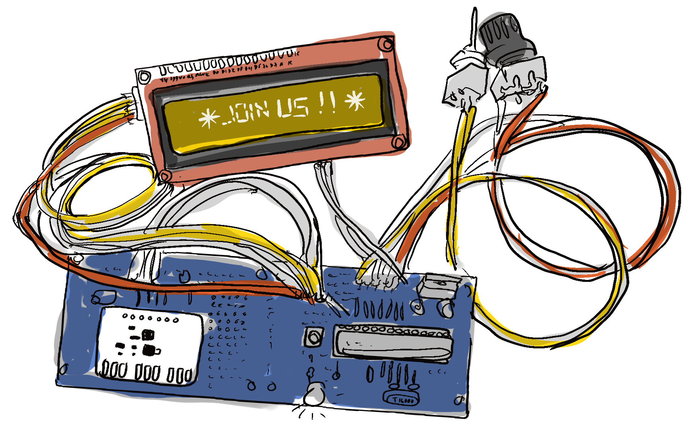

# Open Hardware Academy 🚀

From the **8th of August until the 14th of October 2022** the Delft Open Hardware community will organize its first round of the Open Hardware Academy cohort!

In this 10 week programme we will help you open up your project to the world. We do this with tips and tricks from our experience, and by simple assignments that help your project to be ready for contributions.

````{panels}
:container: +full-width text-center
:column: col-lg-6 px-2 py-2
:card:
:header: text-center

**Design for open source 👍**
^^^
When you design for open source you adopt an iterative and progressive approach. You design for contributors, peers and users and enable them to contribute an give feedback.
---

**A programme design for flexibility 🕐**
^^^
Even if you can't join the 10 weeks programme, it is setup in such a way that you can still join the community chat and use part of the content of the programme, or do the exercises in a different time.
---

**Exercises and lessons ✏️**
^^^
We provide exercises and lessons created from community members. Each set of exercises are focused on different levels of skills and knowledge areas.
---
**Community focused 🌈**
^^^
Are you interested in contributing with new materials? Perhaps organizing a seminar or designing a lesson on a specific technical topic? You can!
````

## Layout of the programme
Yes we will touch upon technical things such as 3D printing, PCB design, documentation and licensing, coding, etc, but there is more. **By the end of this program you should be able to do a first release to the public of your open source project!**

:::{admonition} What will happen during the programme
:class: tip full-width

* We will help you to work towards a first increment (a publishable and reusable outcome). This can be a first foundational component or prototype for example. We also call this an iteration. This iteration involves several aspects that go from design to documentation.
* We show you an approach to designing and developing for open hardware with exercises where designing and testing is at the center. 
* We share complementary materials and lessons that are open educational resources.
* We will host seminars and workshops addressing specific topics related to open source hardware.
* We discuss and address the different exercises on a weekly basis in collaboration with other fellows that join the program and learn from each other's projects.
* We will host open discussions on the proposed topics, exercises and materials to exchange views on open hardware

:::


### Example projects that would fit
* A Raspberry Pi microscope
* Sewing project
* Woodworking project
* Circular solar panel
* A plastic scanner
* A board game
* Internet sensor
* Origami model
* DIY keyboard
* Bed light
* Chair

## Who can participate?
No matter if you are working on a small or a big project, joining the Open Hardware Academy helps you to understand the mechanics of open and collaborative working. In the 10 weeks you will learn about project management, documentation, community building, prototyping and licenses. By the way, did we tell you it’s free?

### These are our only entry requirements:
- Spend at least half a day per week on the project. This includes participating in the lectures as well as applying the things you learn at the Open Hardware Academy in your own project, ideally around 8 hours.
- Bring your own project
- You are based in the Netherlands

We want anyone to be able to join our Open Hardware Academy, you don't need to be technically skilled!

## What you get in return
- A certificate of participation
- Knowledge on Open source hardware 
- Your own open hardware project

## Organizers
This first round of Open Hardware Academy is organized by Delft Open Hardware community members including:

- MSc. Research Hardware Engineer (with a background in Integrated Product Design): Jerry de Vos 
- Msc. Research Software Engineer with a background in Integrated Product Design: Jose Urra
- PhD. Data Steward with a background in Mechanical Engineering: Santosh Ilamparuthi
- Delft Open Hardware community members and helpers

## About Delft Open Hardware
We are grassroots community that found that Op


## Information
Inspired by the Mozilla Open Leadership programme, content for this programme is build upon the open hardware leaders programme.

Personal information that we collect is taken care of by the GPDR(santosh knows more)

If something is unclear or if you have questions please email: j.devos-2@tudelft.nl
