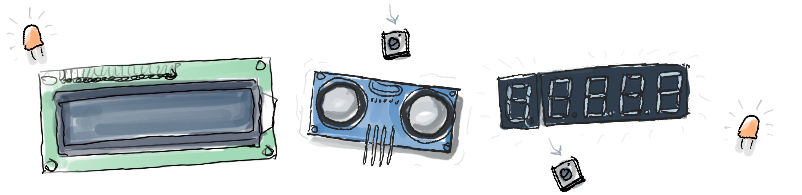

# Programme details 

Yes we will touch upon technical things such as 3D printing, PCB design, documentation and licensing, coding, etc, but there is more. **By the end of this program you should be able to do a first release to the public of your open source project!**

````{panels}
:container: +full-width text-center
:column: col-lg-6 px-2 py-2
:card:
:header: text-center

**Open source driven learning👍**
^^^
When you design for open source you adopt an iterative and progressive approach. You design for contributors, peers and users and enable them to contribute an give feedback.
---

**Hybrid, distributed and flexible model🕐**
^^^
Even if you can't join the 10 weeks programme, it is setup in such a way that you can still join the community chat and use part of the content of the programme, or do the exercises in a different time.
---
**Designed with trainers in mind 📓**
^^^
Are an instructor and teacher you have local needs, and we know our schedule might not fit. But you can reuse the materials and participate in the design of new lessons. [Read more](./04_Partner_up.md)
---

**Challenge and project focused ✏️**
^^^
We provide exercises and lessons created from community members. Each set of exercises are focused on different levels of skills and knowledge areas.
---
**Community centered 🌈**
^^^
We envision that many actors can benefit from this. From established projects looking for new members, to organizations wanting to contribute with open source projects and also educators.
````

:::{admonition} What will happen during the programme

* We will help you to work towards a first increment (a publishable and reusable outcome). This can be a first foundational component or prototype for example. We also call this an iteration. This iteration involves several aspects that go from design to documentation.
---
* We show you an approach to designing and developing for open hardware with exercises where designing and testing is at the center.
--- 
* We share complementary materials and lessons that are open educational resources.
---
* We will host seminars and workshops addressing specific topics related to open source hardware.
---
* We discuss and address the different exercises on a weekly basis in collaboration with other fellows that join the program and learn from each other's projects.
---
* We will host open discussions on the proposed topics, exercises and materials to exchange views on open hardware
:::

## Example projects that would fit
* A Raspberry Pi microscope
* Sewing project
* Woodworking project
* Circular solar panel
* A plastic scanner
* A board game
* Internet sensor
* Origami model
* DIY keyboard
* Bed light
* Chair

```{admonition} Excited?
Read the [participation criteria](03_Participation.md)
```